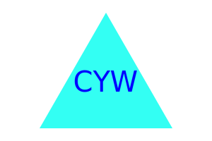
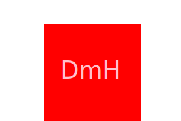

# SVG-Logo-Maker
Week-10 Challenge

## Table of Contents

 * [Description](#description)

 * [Live-Screen-Recording-of-Application-Functionality](#live-screen-recording-of-application-functionality)

 * [Screenshots](#screenshots)

 * [Technologies-Used](#technologies-used)

 * [Installation](#installation)

 * [Credits](#credits)

 * [Features](#features)

 * [Usage-Information](#usage-information)

 * [Contribution-Guidelines](#contribution-guidelines)

 * [Test-Instructions](#test-instructions)

 * [License](#license)

 * [Questions](#questions)

## Description

This application allows users to create a simple logo for their clients and projects so that they can skip paying a graphic designer. The app uses inquirer to prompt the user in the CLI questions about how they want their logo to look (shape, shape color, text, text color). The user can input color name or the hexadecimal representation of the color for the shape color and text color. The text can only display 3 characters or less. Once the user has answered all prompts, then an SVG file is written using their answers to create a logo. This application also uses Jest to test the code to make sure it will render the shapes asked for. This application has possibilities for future additions like more polygon options, font options, text shapes, and color gradients or patterns.

## Live Screen Recording of Application Functionality

[Demo Recording](https://github.com/chelleyoungw/svg-logo-maker/assets/153236313/81d05b33-174d-4a46-86a2-1553f43d1b89)

## Screenshots

Logo Generation

Examples of Generated Logos

## Technologies Used

This project is powered by Node.js v20.11.1, utilizes Inquirer v8.2.6 (node package manager), and file system module (node package manager). It also employs jest v29.7.0 (node package manager) for the unit testing conducted in this application. 

## Installation

1. Clone the repo:
   git clone https://github.com/chelleyoungw/svg-logo-maker.git

2. Open in VS Code. If you do not have VS code you must install it.

3. Using the terminal, install node.js v20.11.1.

4. Once node.js v16 is installed, in the terminal, utilize the command npm init -y to initialize and create a package.json where project files will be stored.

5. Next, use the terminal to run the command npm i to install the dependencies associated with this application (developers may need to install inquirer and jest directly from the command line, to do so the command for inquirer will be npm i inquirer@8.2.6 to install v8.2.6 of the inquirer, and npm i jest to install the latest version of jest).

6. To run the application, within the terminal, type the command node index.js.

## Authors and Achknowledgements

Chelle Wood is the author. Worked with ChatGPT breaking down code, and consulted https://developer.mozilla.org/en-US/docs/Web/SVG/Tutorial for assistance with SVG. Referenced https://github.com/rmessett15/SVG-Logo-Maker.git for assistance with code.

## Features

Features of this application include the users ability to generate logos quickly and easily through the use of SVG files, entirely from the command line. No UI (user interface) needed, and no front end tools needed.  

## Usage Information

To run this application, use the command line to navigate to the directory of the application, install all dependencies (npm i), then type the command node index.js. You will then be taken through a series of questions. Once all questions have been answered properly, a message will display to the command line telling you your logo has been generated. Find your new logo in the newly generated SVG file.

For unit testing instructions, navigate to the Test Instructions section.

## Contributing

Open to collaboration, if you choose to do so open an issue and modify any changes you would like to see on a feature branch and wait for approval before merging to the main branch.

## Test Instructions

To run unit testing, open the terminal, and use the command npm run test.

There is one test suite with three tests. The test suite is checking for a render() method to return a string for the corresponding SVG file with the given shape color (triangle, square, or circle).

## License

MIT License

## Questions

Have additional questions? Click the links below to reach me through my GitHub account or Email address.

[Link to Github](https://github.com/chelleyoungw)

<a href="mailto:chelleyoungw@gmail.com">chelleyoungw@gmail.com</a>
